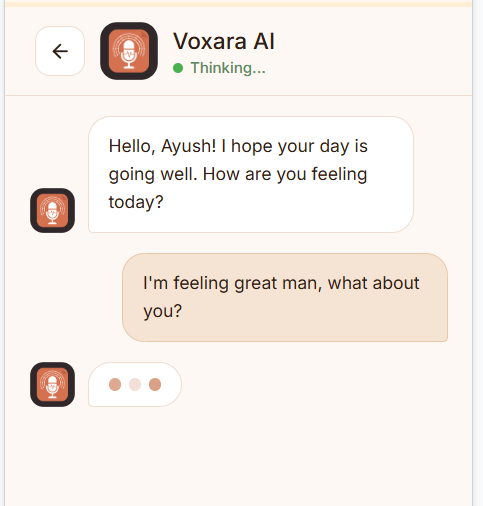

<div align="center">
  

  <h1>Voxara: Voice Health Diary</h1>
  <p><strong>Your Voice Knows before you do.</strong></p>
  
  <p>
    An innovative, AI-powered conversational voice diary that analyzes your voice to predict, track, and manage respiratory conditions (like COPD) and early signs of Parkinson's disease.
  </p>
</div>

---

## 📖 Overview

Voxara bridges the gap between daily lifestyle and proactive healthcare. By leveraging state-of-the-art machine learning models on brief daily voice interactions, Voxara detects subtle vocal changes over time. It effortlessly collects health data through natural conversation, computes ongoing risk scores, and provides intuitive, actionable reports you can share directly with your healthcare provider.

---

## ✨ Key Features

- 🗣️ **Conversational AI Agent** — Simply chat with Voxara AI. Log your daily feelings, symptoms, and thoughts through a friendly, natural voice interface.
- 🔬 **Voice-Based Health Detection** — Proprietary ML models analyze your vocal biomarkers to detect early signs of **Respiratory Diseases (COPD)** and **Parkinson's**.
- 📊 **Weekly Summaries** — A beautifully designed dashboard that summarizes your overall health status, average risk scores, critical alerts, and total recordings over the week.
- 📅 **Daily Breakdowns** — Granular daily reports with "Low", "Moderate", and "High" risk classifications.
- 👩‍⚕️ **Doctor Sharing** — Generate comprehensive reports and easily share them with your physician with the tap of a button.

---

## 📱 App Previews

### 1. Conversational Interface
Speak naturally with Voxara to log your daily health.


### 2. Dashboard, Reports & Additional Previews
Track your weekly progress, view granular daily reports, and export your data directly to your healthcare provider.

<div style="display: flex; flex-wrap: wrap; gap: 10px;">
  
  
  
  
  
  
</div>

---

## 🛠️ Technology Stack

| Layer | Technology |
|-------|-----------|
| **Frontend** | React 18, Vite, Tailwind CSS, Radix UI |
| **Backend Hub** | Java 17, Spring Boot 3, Spring Security (JWT), H2/PostgreSQL |
| **ML Microservice** | Python 3.9, FastAPI, Librosa, Scikit-Learn, Sarvam AI (STT/TTS) |

---

## 📂 Project Structure

```text
voxara/
├── backend/
│   ├── voxara-hub-java/        # Spring Boot API hub (port 8080)
│   │   ├── src/main/java/com/voxara/
│   │   │   ├── controller/     # AuthController, PatientController, ChatController
│   │   │   ├── service/        # PatientService, OpenRouterService, MlProxyService...
│   │   │   ├── entity/         # Patient, Recording, Medication
│   │   │   ├── security/       # JwtAuthFilter, JwtUtils
│   │   │   └── dto/            # Request/Response DTOs
│   │   └── src/main/resources/application.yml
│   └── voxara-ml-python/       # FastAPI ML microservice (port 8000)
│       ├── backend/
│       │   ├── audio_processor.py
│       │   ├── model_loader.py
│       │   ├── mood_analyzer.py
│       │   ├── predictor.py
│       │   ├── sarvam_service.py
│       │   └── models/         # .pkl ML model files
│       ├── main.py
│       └── requirements.txt
└── frontend/                   # React app (port 5173)
    ├── src/
    │   ├── pages/              # Splash, Login, Register, Home, Chatbot...
    │   ├── components/voxara/  # AppLayout, BottomNav, MicButton...
    │   └── lib/                # AuthContext, backendApi
    └── package.json
```

---

## 🚀 Getting Started

### Prerequisites
- Java 17+, Maven 3.8+
- Python 3.9+
- Node.js 18+

### 1. Python ML Microservice

```bash
cd backend/voxara-ml-python
pip install -r requirements.txt
cp .env.example .env  # Fill in your Sarvam API keys
uvicorn main:app --reload --host 0.0.0.0 --port 8000
```

### 2. Java Spring Boot Hub

```bash
cd backend/voxara-hub-java
cp .env.example .env  # Fill in JWT secret, DB config, OpenRouter keys
./mvnw spring-boot:run
```

### 3. Frontend

```bash
cd frontend
npm install
cp .env.example .env  # Set VITE_API_BASE_URL=http://localhost:8080
npm run dev
```

---

## 🔑 Environment Variables

### `backend/voxara-hub-java/.env.example`
```
DB_USERNAME=postgres
DB_PASSWORD=yourpassword
JWT_SECRET=<at-least-32-chars>
PYTHON_URL=http://localhost:8000
UPLOAD_DIR=./uploads/audio
```

### `backend/voxara-ml-python/.env.example`
```
SARVAM_API_KEY=<your-sarvam-key>
```

### `frontend/.env.example`
```
VITE_API_BASE_URL=http://localhost:8080
```

---

## 📡 API Reference

### Auth (public)
| Method | Path | Description |
|--------|------|-------------|
| POST | `/api/auth/register` | Create patient account |
| POST | `/api/auth/login` | Login → JWT token |

### Patient (JWT required)
| Method | Path | Description |
|--------|------|-------------|
| GET | `/api/patient/profile` | Patient profile + gamification |
| GET | `/api/patient/history` | Recording history |
| POST | `/api/patient/analyze/voice` | Voice analysis (multipart) |
| GET | `/api/patient/audio/{filename}` | Stream audio file |
| POST | `/api/patient/chat` | AI chat response |

### ML Microservice (internal)
| Method | Path | Description |
|--------|------|-------------|
| GET | `/health` | Service health |
| POST | `/analyze-audio` | Acoustic risk prediction |
| POST | `/analyze-mood` | Text mood scoring (VADER) |
| POST | `/analyze-conversational-audio` | STT + Mood + ML in one call |
| POST | `/bot/speak` | Sarvam TTS → WAV stream |

---

## 👥 Team

Built with ❤️ for proactive healthcare monitoring.
